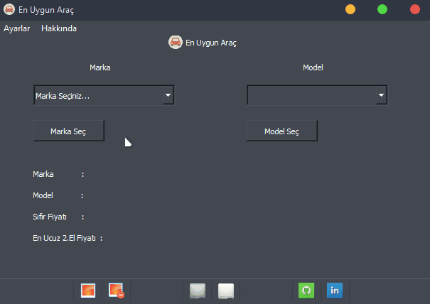
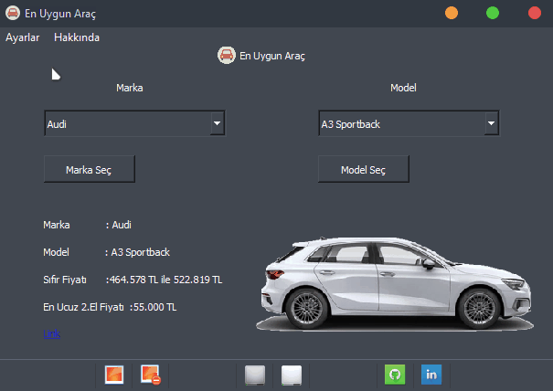
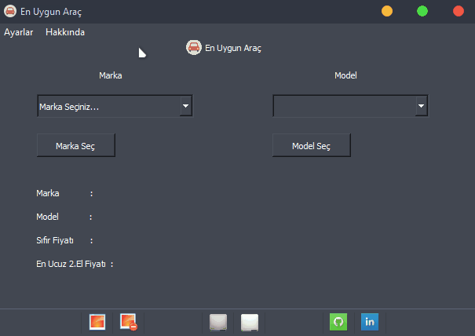
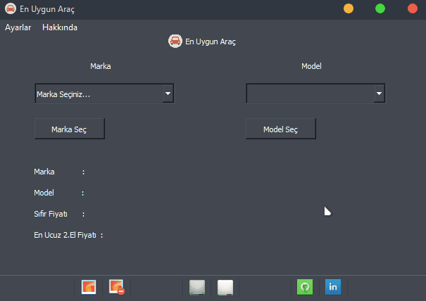

<br/>
<p align="center">
  <a href="https://github.com/Furkan-izgi/En Uygun Araç">
    
  </a>

  <h3 align="center">En Uygun Araç</h3>

  <p align="center">
    Aradığınız aracın 2. el en ucuz fiyatını anında bulun!
    <br/>
    <br/>
    |
    <a href="https://github.com/Furkan-izgi/EnUygunArac/issues">Hata Bildir!</a>
    .
    <a href="https://github.com/Furkan-izgi/EnUygunArac/pulls">Koda Ekleme Yap!</a>
    |
  </p>
  <h4>Not: Okulumdaki yoğunluğumdan dolayı bir türlü güncelleme yapamadım. İlgilenmeye çalışacağım.</h4>
</p>

   

## Proje Hakkında

Sürekli siteleri gezerek istediğiniz arabanın en ucuzunu arayarak vakit mi kaybediyorsunuz? 

O zaman En Uygun Araç tam size göre!

İstediğiniz aracın, istediğiniz modelinin sıfır ve en ucuz 2. el fiyatını size gösteren En Uygun Araç, yine sizi düşünerek ilanın linkini de sizinle paylaşıyor!

### Neden En Uygun Araç ?

* Vaktiniz önemlidir! Kim dakikalarını, saatlerini bir araba için harcamak ister ki! En Uygun Araç size vakitten kazanç sağlar! 
Ne de olsa "Vakit nakittir!" :smile:
* Her seferinde malum sitelere girerek arama yapmak yerine sizlere hazır olarak verilmiş markalar ve modeller arasından istediğinizi hızlıca seçebilirsiniz!

### Eklenecekler:
* ~~Bazı markaların modellerinin fotoğrafları sisteme eklenecek.~~
* ~~Karanlık ve aydınlık mod eklenecek.~~
* Android ve IOS için uygulama yapılacak.(Flutter öğrenildikten sonra)
* Projenin arayüzünde düzenlemeler ve fonksiyonlarda iyileştirmeler yapılacak

## Özellikler
* Açık ve Koyu Mod



* Resimleri Aç/Kapa



* Hakkında




### Gereklilikler

Gerekli olan programlar:

* Python (3.5.x ve üstü) (Son sürüm önerilir)
* Beautifulsoup Kütüphanesi
```sh
pip install beautifulsoup4
```
* Requests Kütüphanesi
```sh
pip install requests
```
* PyQt Kütüphanesi
```sh
pip install PyQt5
```
### Kurulum
En Uygun Araç'ı kurmak oldukça basit!
* Sağ üstte bulunan "Code" kısmına tıklayıp "Download ZIP" veya diğer şeçenekler ile bilgisayarına indirip "frontend.py" dosyasına çift tıklaman yeterli.

## Kullanım
* Örnek Kullanım



_Daha fazla örnek ve geliştirme için, destek olmayı unutmayın!_

## Destek ve Katkıda Bulunma

Projeyi destekleyip katkıda mı bulunmak istiyorsun? İşte yapacakların:

1. Projeyi "fork" et!
2. Eklemelerini, hata düzeltmelerini yap.
3. "Pull Request" veya "Issue" açarak projeye katkıda bulun!


### PR (Pull Request) ve Issue Oluşturma ve Önemli Uyarılar

En Uygun Araç'ı yapan sadece 1 kişi! En Uygun Araç'a ek özellikler, hata düzeltmeleri yapmanız beni **fazlasıyla** mutlu edecektir.
* Projeye eklemek veya projeden kaldırmak istediklerinizi [Issue](https://github.com/Furkan-izgi/EnUygunArac/issues/new) kısmından bana iletebilir ya da direkt olarak "Pull Request" yolu ile *Proje* üzerinde gerekli gördüğünüz değişiklikleri yapabilirsiniz.
* Katkıda bulunurken lütfen imla ve yazım kurallarına uyun.
* Her öneri / düzeltme için **bir** adet PR veya Issue oluşturun.

## Lisans

Bu proje "GNU General Public License v3.0" lisansı ile tescillenmiştir. Lisansı görmek için [Tıkla](https://github.com/Furkan-izgi/EnUygunArac/blob/main/LICENSE.md) .

## Eser Sahibi

* **Furkan İzgi** - *Elektrik Elektronik Mühendisi / Geliştirici* - [Github](https://github.com/Furkan-izgi/) -

## Teşekkürler

* [Furkan İzgi](https://github.com/Furkan-izgi/)
